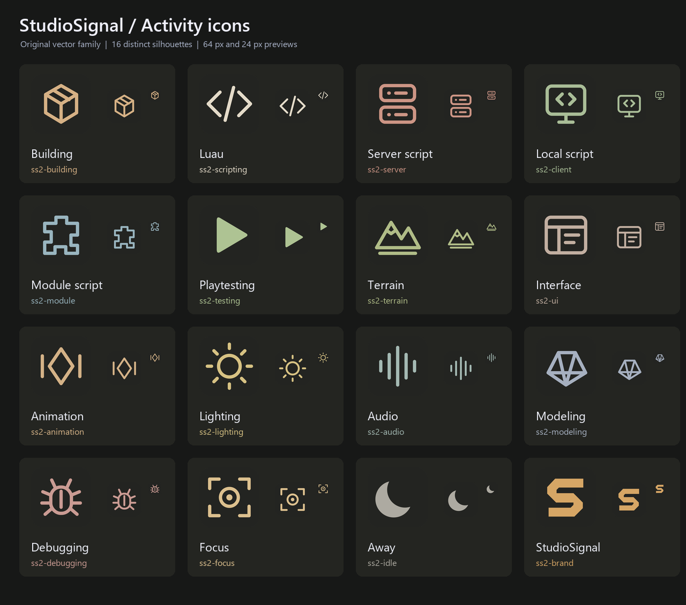

<p align="center">
  
</p>

<h1 align="center">StudioSignal</h1>

<p align="center">
  <strong>Your Roblox Studio activity, on Discord.</strong>
</p>

<p align="center">
  <a href="https://create.roblox.com/store/asset/106042257002847">Install from Roblox Creator Store</a> ·
  <a href="plugin/StudioSignal.luau">View complete script</a>
</p>

StudioSignal is a free, open-source plugin that shows what you're working on in Roblox Studio on your Discord profile. Let it follow the active script and play state, or choose an activity yourself.

**No companion app or local server to install.** Your project name and link stay hidden by default.

## Features

- **Automatic or manual:** follow Studio, or select one of 15 activities.
- **Project privacy:** keep the project hidden, use a display name, or include a project link.
- **Focus sessions:** start a 25 or 50 minute session with a countdown.
- **Idle controls:** pause sharing or show Away when you're inactive.
- **Sharing controls:** preview your activity, then start, pause, resume or disconnect.

## Activity icons

Each activity has its own icon. The smaller StudioSignal badge identifies the plugin.

<p align="center">
  
</p>

Editable SVGs, PNGs and the Studio atlas are in [assets](assets/). Artwork generation uses Pillow and CairoSVG.

## Installation

**[Get StudioSignal v1.0 for free on Roblox Creator Store](https://create.roblox.com/store/asset/106042257002847).**

Open StudioSignal from the Plugins toolbar, connect your Discord account, then choose **Start sharing**. This repository is for browsing and developing the source code.

## Source code

- [StudioSignal.luau](plugin/StudioSignal.luau): the complete plugin in one readable script.

The complete script is generated from [src](src/). For development, edit the modules in `src/`, then run the build to update it.

## Development build

Requires Python 3:

```sh
python scripts/build.py
python scripts/package.py
```

The build refreshes the complete script in `plugin/`. Files for development and publishing are written to `dist/`, which is excluded from Git:

- `StudioSignal-v1.0.rbxmx`: plugin model for publishing to Roblox Creator Store.
- `StudioSignal-v1.0.zip`: packaged source and build.
- `test-bundle.luau`: Studio test runner.

## Project structure

| Folder | Contents |
| --- | --- |
| [src](src/) | Luau modules |
| [plugin](plugin/) | Complete generated Luau script |
| [tests](tests/) | Tests using mocked Discord responses |
| [scripts](scripts/) | Build, packaging and artwork tools |
| [assets](assets/) | Logo, activity icons and atlas |
| [docs](docs/) | Integration details and limitations |

## Tests

Run the build, then execute `dist/test-bundle.luau` in a Roblox Studio plugin context. It returns the passing test count and names. The suite does not start the plugin or make live Discord requests.

## Discord integration

Activity updates go directly from Studio to Discord. Credentials stay in memory, and script source, script names and file paths are not sent.

Discord's current authorization includes friends and invite permissions alongside activity. The plugin does not use those social features. The Headless Sessions transport is experimental; see [integration details](docs/INTEGRATION.md) for the full permission scope and limitations.

## A note on development

For transparency, I used **GPT-6 Astra** during development. It helped me complete a substantial part of the work on this plugin.

## License

StudioSignal is available under the [MIT License](LICENSE).
