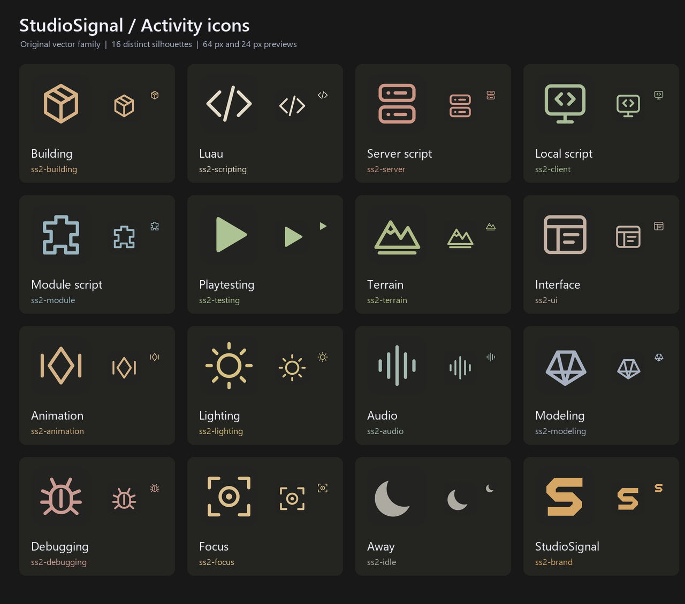
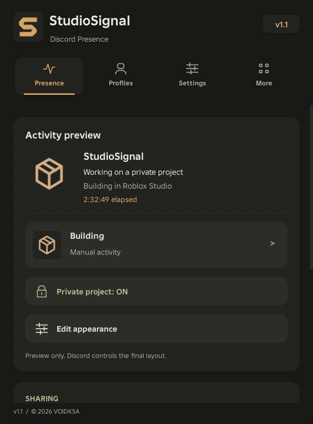
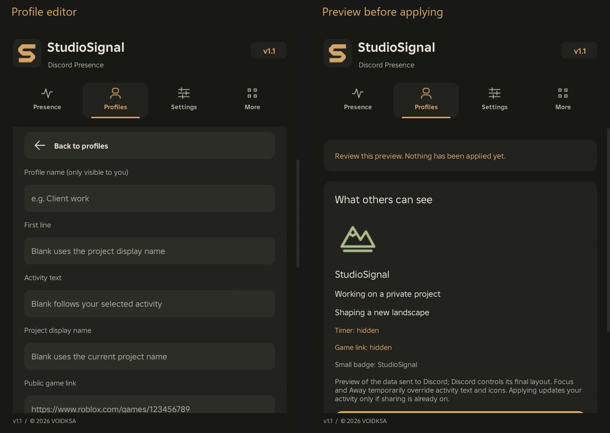

<p align="center">
  
</p>

<h1 align="center">StudioSignal</h1>

<p align="center">
  <strong>Your Roblox Studio activity, on Discord.</strong>
</p>

<p align="center">
  <a href="https://create.roblox.com/store/asset/106042257002847">Install from Roblox Creator Store</a> ·
  <a href="plugin/StudioSignal.luau">View complete script</a>
</p>

StudioSignal is a free, open-source plugin that shows what you're working on in Roblox Studio on your Discord profile. Let it follow the active script and play state, or choose an activity yourself.

**No companion app or local server to install.** Your project name and link stay hidden by default.

## Features

- **Automatic or manual:** follow Studio, or select one of 15 activities.
- **Project privacy:** keep the project hidden, use a display name, or include a project link.
- **Focus sessions:** start a 25 or 50 minute session with a countdown.
- **Idle controls:** pause sharing or show Away when you're inactive.
- **Sharing controls:** preview your activity, then start, pause, resume or disconnect.
- **Saved profiles:** customize text, activity, icon, privacy and a public game link. Review before applying, or pin a profile to a published place.
- **Phone sign-in:** scan a locally generated QR code to open Discord with your verification code filled in, then review and approve the connection.
- **Connection help:** retry guidance and a support report that excludes credentials and project details.

## Activity icons

Each activity has its own icon. The smaller StudioSignal badge identifies the plugin.

<p align="center">
  
</p>

Editable SVGs, PNGs and the Studio atlas are in [assets](assets/). Artwork generation uses Pillow and CairoSVG.

## Installation

**[Get StudioSignal for free on Roblox Creator Store](https://create.roblox.com/store/asset/106042257002847).**

Open StudioSignal from the Plugins toolbar, connect your Discord account, then choose **Start sharing**. This repository is for browsing and developing the source code.

## What's new in v1.1

Create up to 20 profiles in the new **Profiles** tab. Editing and saving a draft
does not change your current activity. Preview it, apply it for this session, or
save and pin it to a published place. Pinned profiles load when that place opens;
connecting and starting sharing remain explicit actions.

The reorganized interface adds phone sign-in via QR, clearer connection guidance
and a safe support report. It retains the v1.0.1 panel restoration fixes for Edit
and Play. Release notes are also available inside **More**.

See the [changelog](CHANGELOG.md) for release history.

## v1.1 walkthrough

[Watch the complete v1.1 walkthrough](https://youtu.be/yhjIbMEuUG0): QR sign-in,
the new interface, profiles, public game links, privacy and actual Discord results.

<p align="center">
  
</p>

<p align="center">
  
</p>

## Source code

- [StudioSignal.luau](plugin/StudioSignal.luau): the complete plugin in one readable script.

The complete script is generated from [src](src/). For development, edit the modules in `src/`, then run the build to update it.

The public source is a development reference. It leaves `ApplicationId` empty
and uses placeholders for Discord artwork identifiers. To run a fork, configure
your own Discord application and upload its artwork. The ready-to-use plugin
is installed from Roblox Creator Store.

## Development build

Requires Python 3:

```sh
python scripts/build.py
python scripts/package.py
```

The default build refreshes the unconfigured complete script in `plugin/`.
Development files are written to `dist/`, which is excluded from Git:

- `StudioSignal-v1.1.rbxmx`: unconfigured development model, not the official Store package.
- `StudioSignal-v1.1.zip`: packaged source and build.
- `test-bundle.luau`: Studio test runner.

For a configured distribution, keep your public application ID and artwork IDs
in an untracked `.local/deployment.json` with `applicationId` and `assetIds`
properties. Use the keys from `assets/icons/discord-assets.json` for `assetIds`.
Then run `python scripts/build.py --deployment-config .local/deployment.json`.
This writes only to `.local/dist/` and never changes the tracked public script.
Do not put client secrets, bot tokens or user tokens in either configuration.

## Project structure

| Folder | Contents |
| --- | --- |
| [src](src/) | Luau modules |
| [plugin](plugin/) | Complete generated Luau script |
| [tests](tests/) | Tests using mocked Discord responses |
| [scripts](scripts/) | Build, packaging and artwork tools |
| [assets](assets/) | Logo, activity icons, editable action SVGs and image atlases |
| [docs](docs/) | Integration details and limitations |

## Tests

Run the build, then execute `dist/test-bundle.luau` in a Roblox Studio plugin context. It returns the passing test count and names. The suite does not start the plugin or make live Discord requests.

For the UI smoke test, execute `dist/ui-test-bundle.luau` in the same context.
It creates and removes an isolated preview, exercises the profile
workflow and checks layout bounds at three sizes. Its settings stay in memory and
it does not sign in or send activity.

## Discord integration

Activity updates go directly from Studio to Discord. Credentials stay in memory, and script source, script names and file paths are not sent.

Profiles and place pins are stored locally through Studio's plugin settings.
Private mode hides the first line, project name and game link. Custom activity
text is still shared, so review it before applying and avoid sensitive details.

Discord's current authorization includes friends and invite permissions alongside activity. The plugin does not use those social features. The Headless Sessions transport is experimental; see [integration details](docs/INTEGRATION.md) for the full permission scope and limitations.

## A note on development

For transparency, I used **GPT-6 Astra** during development. It helped me complete a substantial part of the work on this plugin.

## License

StudioSignal is available under the [MIT License](LICENSE).
